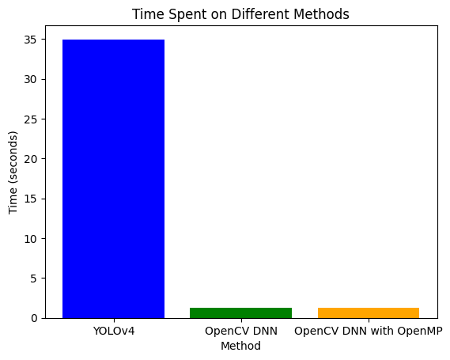

# Object Detection and Similarity Computation

## Project Overview

This project involves the implementation of object detection and fuzzy similarity computation between two images. It uses a MobileNet-SSD model for object detection and a Sobel filter to compute image similarity based on the structure of the images.

The code utilizes OpenCL for efficient parallel processing on the GPU, OpenMP for multi-threading, and OpenCV for image processing. The Fuzzy Longest Common Subsequence Similarity (F_LCSS) metric is used to compare the detected objects between two images.

### Key Technologies:
- **OpenCL**: For GPU-accelerated image processing with the Mali-T628 GPU.
- **OpenMP**: For parallel programming using multi-core processors.
- **OpenCV**: For image manipulation and object detection.
- **Deep Learning**: MobileNet-SSD for object detection.

## Project Features

1. **Object Detection**: Using MobileNet-SSD (Caffe model), the code detects objects in images and highlights them with bounding boxes and class labels.
   
2. **Sobel Filter**: A Sobel filter is applied to the images to compute edge information, which is used for image similarity comparison.

3. **Fuzzy Similarity (F_LCSS)**: This metric computes the similarity between two images based on their Sobel-filtered outputs.

4. **OpenCL and OpenMP**: The project uses OpenCL for GPU acceleration and OpenMP for multi-core CPU processing, providing better performance for the computationally expensive parts.

## Setup and Requirements

To run this project, you need the following:

- **C++**: For compiling and running the main program.
- **OpenCV**: For image processing and object detection.
- **OpenCL**: For GPU-accelerated computations.
- **OpenMP**: For parallel CPU processing.
- **Caffe Model Files**: MobileNet-SSD model files (`.prototxt` and `.caffemodel`).

### Installation

1. **Install OpenCV**: Follow the official OpenCV installation guide for your platform.
2. **Install OpenCL**: Install the OpenCL SDK suitable for your GPU (Mali-T628 in this case).
3. **Download Caffe Model**: You will need the MobileNet-SSD model files. Download them from [here](https://github.com/chuanqi305/MobileNet-SSD).

### Build Instructions

1. Clone the repository to your local machine:

   ```bash
   git clone <your-repository-url>




YOLOv4: This method took the most time, with a total of 34.9722 seconds. YOLOv4 (You Only Look Once version 4) is a popular and powerful deep learning model for real-time object detection. However, its processing time can be higher due to the complexity of the model and the need for high computational resources.

OpenCV DNN: The second method, OpenCV DNN, took significantly less time, with a total of 1.2876 seconds. OpenCV's deep neural network (DNN) module allows for running pre-trained models, and it is optimized for efficiency. The time here is much lower compared to YOLOv4, indicating that the OpenCV DNN approach is faster, likely due to lighter models or optimizations.

OpenCV DNN with OpenMP: The third method, OpenCV DNN with OpenMP, took 1.25977 seconds, which is almost the same as the previous method but slightly faster. OpenMP (Open Multi-Processing) is a parallel programming model that allows for better utilization of multi-core processors, leading to improved performance.

Key Insights:
YOLOv4 is much slower than OpenCV DNN and OpenCV DNN with OpenMP. This suggests that while YOLOv4 is highly accurate, it is computationally intensive.
OpenCV DNN and OpenCV DNN with OpenMP are significantly faster, with the OpenMP-optimized version being marginally quicker.
