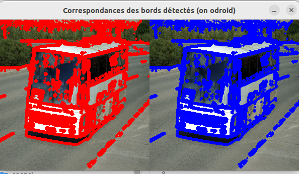
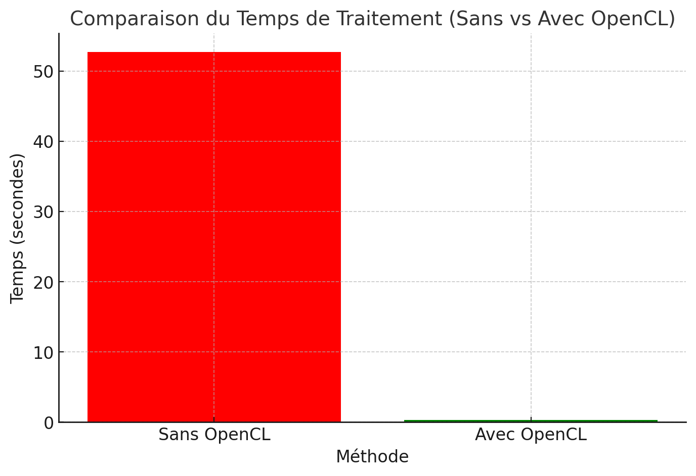

# Fuzzy Longest Common Subsequence (F_LCSS) avec Détection de Bords Sobel

Ce projet applique la **Fuzzy Longest Common Subsequence (F_LCSS)** pour comparer les bords détectés dans deux images à l'aide des **filtres Sobel**. L'approche détecte d'abord les bords dans les deux images, extrait les points représentant les bords forts, puis compare ces points à l'aide d'une fonction de similarité floue pour calculer un score de similarité.

## Description

1. **Détection de Bords Sobel** : Le filtre Sobel est appliqué manuellement pour calculer les gradients dans les directions horizontale et verticale. Cette étape met en évidence les bords de l'image en calculant l'amplitude du gradient pour chaque pixel.

2. **Fuzzy Longest Common Subsequence (F_LCSS)** : Après la détection des bords dans les deux images, les points où les bords forts sont détectés sont extraits comme trajectoires. Ces trajectoires sont ensuite comparées à l'aide d'une fonction de similarité floue. La fonction attribue une valeur d'appartenance à chaque point de la séquence en fonction de sa distance par rapport à d'autres points. Le score F_LCSS est calculé en pourcentage de similarité entre les trajectoires des deux images.

3. **Visualisation** : Les points correspondant aux bords forts sont marqués sur les images en couleurs différentes (rouge pour l'image 1, bleu pour l'image 2). Les images sont ensuite affichées côte à côte pour une comparaison visuelle facile.

4. **Temps de Traitement** : Le programme mesure et affiche le temps nécessaire pour chaque étape significative, y compris le chargement des images, la détection des bords Sobel et le calcul de F_LCSS.

